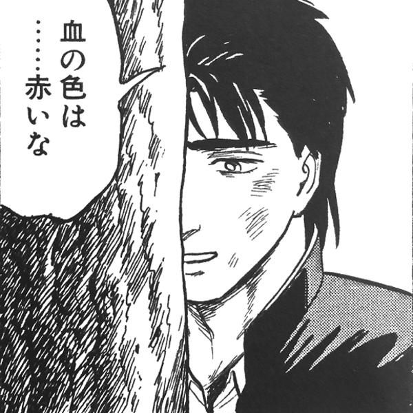

# 居眠り監視アラート

## 製品概要
### コンセプト

寝落ちを防ぐアプリ。
頭のおかしいプロダクトを目指した。反省はしているが後悔はしていない。

### 背景（製品開発のきっかけ、課題等）
新生活のスタートダッシュを怠惰でやらないのはもったいない！→きちんとやることはできるようにしよう！  
課題を落とさない！単位を落とさない！決して単位をあきらめない！それが大学生だ！

### 製品説明（具体的な製品の説明）
・アンドロイドアプリです  
・スマホ端末の加速度を検知して、居眠りを検知し，寝ないように振動と音で使用者を起こします  
・使用する際は、頭に帽子をかぶり、スマホを取り付け、ボタンをONにしましょう  
・ボタンONにて居眠り監視状態に移行し，その状態で居眠りを検知した場合強制起床モードに移行します  
・強制起床モードでは，ヘビメタがスマホから流れ，仕様者はヘッドバンギングをある一定以上しなければこれを解除できません．  
・ヘッドバンギングが成功した場合，最初の画面に戻ります．  

### 特長
#### 1つ目
加速度センサーを使用して使用者の居眠りを検知します．  
居眠りを検知したらヘビメタが流れます．

#### 2つ目
携帯を帽子に装着するので、勉強中に携帯が目に入りません。  
ヘッドバンギングにも耐えうるよう設計しました．

#### 3つ目
ヘッドバンギングをしなければアラームが止まりません。  
激しいヘッドバンギングで首を痛めるかも。

### 解決出来ること
不要な睡眠を防止する  
寝落ちによる課題未提出を防止  
ヘッドバンギングによるストレス発散

### 今後の展望
- 振動のみと音の切り替え  
- ヘッドバンギングを使用した音ゲーの開発

## 開発内容・開発技術
### 活用した技術
#### 言語
- Java  
- XML

#### フレームワーク・ライブラリ・モジュール（使っていれば）
- AndroidStudio  
- Android.sensorListenerライブラリ

#### デバイス（使っていれば）
- 特製ハット  
- スマートフォン

## メンバーの役割
- 小枝 俊也：加速度を検知するアルゴリズムの作成
- 宍戸 建元：振動・音・UIの実装
- 佐藤 篤志：UIの制作 プレゼンテーションの資料の作成
- 小池 仁　: 音の実装

## 今回のハッカソンで得たこと（学び）
- 己の未熟さ 脆弱な精神 腐った根性
- Android StudioとJavaの学習
- GitHubの使い方
